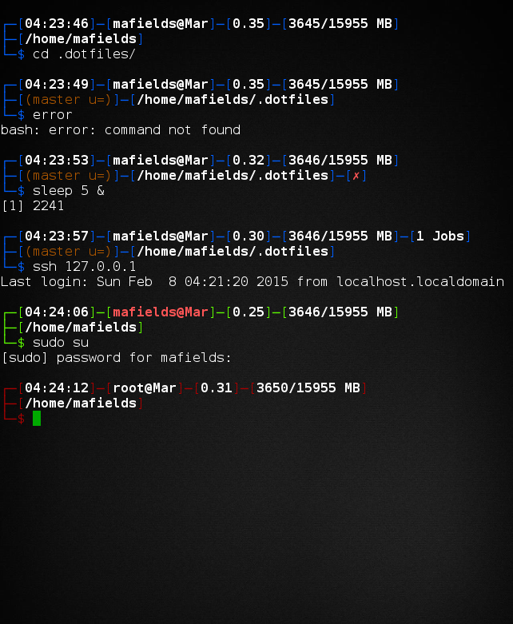

# Dotfiles (Matt Fields)  

Personal repository of dotfiles. This is for those settings that migrate well
from machine to machine and that I consider safe to publish. You’re welcome to
use them, and there’s an attempt to keep my own personal data out of the files,
but you’ll probably want to fork it to remove anything peculiar to my setup
that I’ve left in here. In particular I think my git and pianobar configs 
have my user info in it, but everything else should be fairly generic.

```bash
$ git clone git://github.com/bitdagger/dotfiles.git ~/.dotfiles
```

It’s more likely you’ll want to read the configuration files and find snippets
relevant to your particular workflow.

## Prompt  

My prompt currently looks like this:  

  

By default it will show the following:  
[currentTime] [user@Host] [cpuLoad] [memoryUsage]  
[pwd]  
$

It expands based on context to include the number of active jobs (after memoryUsage), 
a git info section (before pwd) and if the last exit status was non-zero, a red X 
(after pwd).  

Additionally the prompt will re-color itself to red if being used by the superuser, 
and the user@Host section will re-color itself bold-red with the main prompt color 
green if the active session is an ssh session.  

The normal colors of the prompt will also gracefully degrade to more limited color 
options for 8-color and no-color terminals.  

You can also get a simple $ prompt by calling `prompt off`, and restore the fully 
featured prompt with `prompt on`. You can disable the git info from running/displaying 
with the `prompt git off` command, and similarly turn it back on with `prompt git on`.

## Installation

The installation `Makefile` will overwrite things standing in the way of its
installed files without backing them up, so read the output of `make -n
install` first to make sure you aren’t going to lose anything unexpected. Even
better, if you’re still not sure, give it a temporary directory to which it can
install to check things out:

    $ mktemp -d
    /tmp/tmp.YZFW8ScFZP
    $ make install HOME=/tmp/tmp.YZFW8ScFZP

To install, use the following:

```bash
$ make install
```

### Testing

You can test that both sets of shell scripts are syntactically correct with
`make test-bash`, `make test-sh`, or `make test` for everything.

### Uninstall  

You can remove everything `make install` installs by running `make distclean`.  

Keep in mind that this will remove everything entirely, even if you've made 
any changes of your own. Run `make -n distclean` to see what it will remove 
before you commit to running the clean.

# License  

Public domain; see the included `UNLICENSE` file. It’s just configuration, do
whatever you like with it if any of it’s useful to you. 
