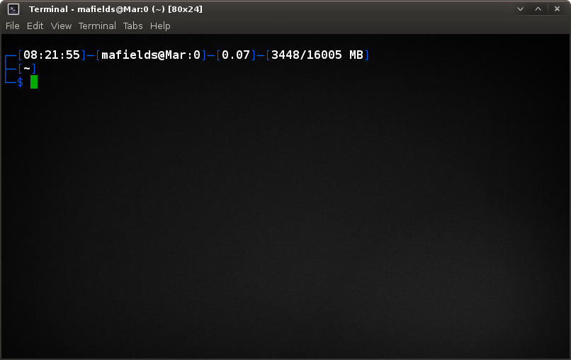
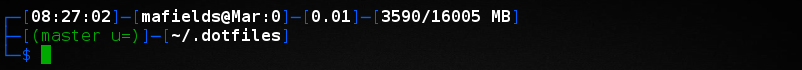
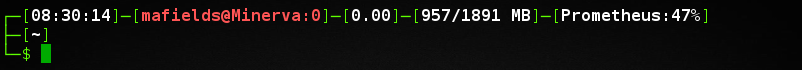

# Dotfiles (Matt Fields)  

Personal repository of dotfiles. This is for those settings that migrate well
from machine to machine and that I consider safe to publish. You’re welcome to
use them, and there’s an attempt to keep my own personal data out of the files,
but you’ll probably want to fork it to remove anything peculiar to my setup
that I’ve left in here. In particular I think my git and pianobar configs 
have my user info in it, but everything else should be fairly generic.

```bash
$ git clone git://github.com/bitdagger/dotfiles.git ~/.dotfiles
```

It’s more likely you’ll want to read the configuration files and find snippets
relevant to your particular workflow.

## Prompt  

My prompt currently looks like this:  

  

By default it will show the following:  
[currentTime]-[user@Host:tty]-[cpuLoad]-[memoryUsage]-[jobs]-[battery]-[wifi]  
[git]-[pwd]-[errorCode]  
-$  

It expands based on context to show as much pertinent information as possible, 
but will hide information that is not currently relevant. For example if there 
are no jobs running, then the jobs counter will be hidden. If it can't find a 
battery or wifi interface then it will hide those. If you're not in a git 
repository then it hides that. If the last errorcode was zero then it hides that.  

Additionally the prompt will re-color itself based on the context in which it 
was created. If spawned by the superuser the framing color will change from blue 
to red. If the active terminal is via an SSH session the framing color will 
change from blue to green, and the user@hostname text will change to red.  

The normal colors of the prompt will also gracefully degrade to more limited 
color options for 8-color and no-color terminals, while the UTF-8 framing and 
icons will degrade to simple ASCII if UTF-8 is not supported.  

You can get a simpler prompt by calling `prompt simple`. This removes most of 
the dynamic information, leaving you with only the time, user@hostname:tty, git, 
pwd, and errorcode. If you need a barebones prompt, you can get a simple $ 
prompt by calling `prompt off`. Reverting back to the full-featured prompt is 
done by calling `prompt on`. Additionally, if you need to disable the git 
information for either the full prompt or the simple prompt you can use the 
`prompt git off` command, and similarly re-enable it with `prompt git on`.  

Here's some pictures:  

Long directory  
  
Error  
  
Git repository  
  
Jobs running  
  
SSH session  
  
Root prompt  
  
Simple prompt  
  
Prompt off  
  

## Installation

The installation `Makefile` will overwrite things standing in the way of its
installed files without backing them up, so read the output of `make -n
install` first to make sure you aren’t going to lose anything unexpected. Even
better, if you’re still not sure, give it a temporary directory to which it can
install to check things out:

```bash
$ mktemp -d
/tmp/tmp.YZFW8ScFZP
$ make install HOME=/tmp/tmp.YZFW8ScFZP
```

To install, use the following:

```bash
$ make install
```

There are a few optional configuration files such as pianobar and sublime that 
are not installed with the core install. These have their own individual 
installation via `make install-pianobar` and `make install-sublime3` 
respectively. Xorg config can also be installed via `make install-X`.

### Testing

A quick test is performed on all the shell scripts before installation to ensure 
they will source correctly and return with a zero status. You can manually run 
the test yourself if you like via `make test`.

### Uninstall  

You can remove everything `make install` installs by running `make distclean`.  

Keep in mind that this will remove everything entirely, even if you've made 
any changes of your own. Run `make -n distclean` to see what it will remove 
before you commit to running the clean.  

Any of the optional installations have their own clean targets via 
`make clean-pianobar`, `make clean-sublime3`, and `make clean-X`.  

# License  

Public domain; see the included `UNLICENSE` file. It’s just configuration, do
whatever you like with it if any of it’s useful to you. 
